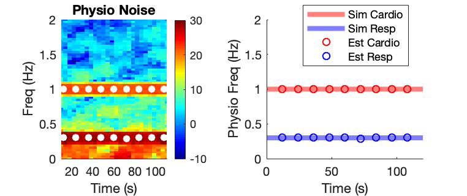
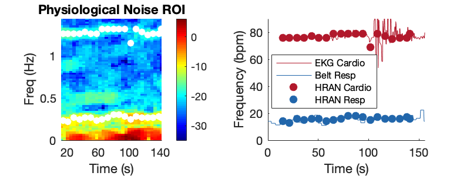
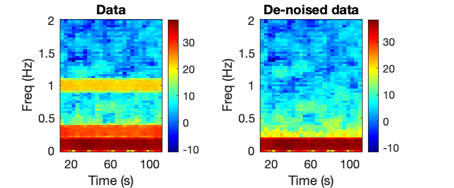
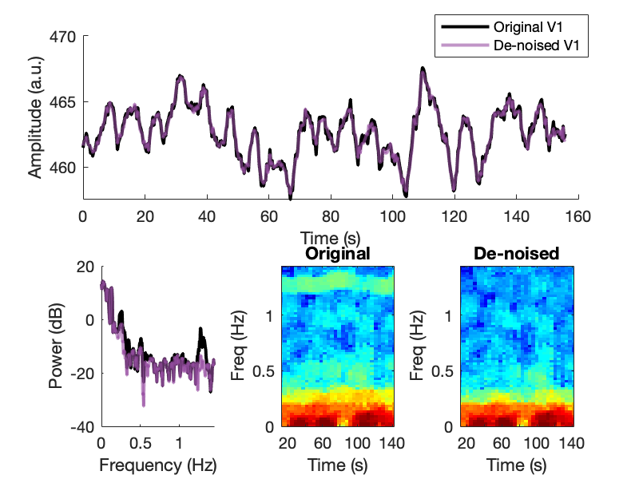

# HRAN - Physiological noise removal for fast fMRI

We created a statistical tool to estimate and remove physiological noise in fast fMRI ([Agrawal et. al. 2019](http://www.googlescholar.com)). Below, we describe the steps for implementing the software:

## Prerequisites

HRAN was created and tested in MATLAB 2018 and 2019 ([MathWorks](https://www.mathworks.com/)).

HRAN uses chronux toolbox, available at [chronux](http://chronux.org/).

After downloading MATLAB and chronux, please direct your scripts to the appropriate directory by adding the following line:

```Matlab
addpath(genpath('/PATH/chronux'))
```

where PATH is the path to the chronux directory.

## Installing

Our software package HRAN is available at our lab Git - [HRAN](https://github.com/LewisNeuro).

We recommend running the `HRAN_demo_nifti.m` or `HRAN_demo_simulated.m` script in order to test if the program was downloaded successfully.

## Running

### Estimating physiological frequencies
As illustrated in `HRAN_demo_nifti.m` and `HRAN_demo_simulated.m`, physiological frequencies are first estimated from an anatomically defined ROI (e.g. the ventricles), with the following input parameters:

```Matlab
% TR, moving window length, percent overlap
inputParams = struct;
inputParams.TR = %TR of fMRI data (s)
inputParams.windowLength = % length of moving window (s) (e.g. 24-30s)
inputParams.percentOverlap = % percent overlap of windows (e.g. .5 or .75)

% Neural regressors of design matrix (time x # regressors)
% Estimated neural signal components to be used in GLM
% e.g. neural stimulus convolved with HRF
neuralZ = [cos(2*pi*neuralFrequency.*time)'; sin(2*pi*neuralFrequency.*time)'];
inputParams.neuralZ = neuralZ;

% Physiological frequency range
inputParams.cardiacFreqRange = % cardiac fundamental freq range (bpm, e.g. 40 - 80)
inputParams.respFreqRange =  %resp fundamental freq range (bpm, e.g. 10 - 20)

% Model orders used to estimate the cardiac and respiratory frequencies
% from physiological time series
inputParams.P_freq = % AR order used to estimate physio frequencies (e.g. 1-4)
inputParams.R_freq = % Resp order used to estimate physio frequencies (e.g. 1-4)
inputParams.C_freq = % Cardiac order used to estimate physio frequencies (e.g. 1-3)
inputParams.N_freq = % Number of neural regressors used to estimate physio freqs (e.g. 0 bc assuming no neural signal in this region)
inputParams.X_freq = % Interaction order used to estimate physio frequencies (e.g. 0-1)

% Model orders used to create design matrix to regress physio noise from
% each voxel in the brain
inputParams.P_Z = % AR order used to regress physio noise (e.g. 1-4)
inputParams.R_Z = % Resp order used to regress physio noise (e.g. 1-4)
inputParams.C_Z = % Cardiac order used to regress physio noise (e.g. 1-3)
inputParams.N_Z = size(neuralZ,2); % Number of neural regressors used to regress physio noise (e.g. number of columns in neuralZ)
inputParams.X_Z = % Interaction order used to regress physio noise (e.g. 0-1)

% Toggle for waitbar on or off
waitbarBoolean = % 1 - on, 0 - off
```

Then, the function `HRAN_estimatePhysFreqs` is called with the specified physiologicalData time series and input parameters:

```Matlab
% Run function to estimate physiological frequencies
HRAN_estFreqs_outputParams = HRAN_estimatePhysFreqs(physiologicalData,inputParams,waitbarBoolean);
```

One should look at the spectrogram of the physiologically noisy region with the estimates of the fundamental frequencies overlaid to confirm that frequencies were estimated correctly (as shown below from `HRAN_demo_simulated` and `HRAN_demo_nifti`):




### Regressing physiological noise from voxels/ROIs

Once the physiological frequencies are known, HRAN can efficiently remove physiological noise across any voxel/ROI.

The output parameters `HRAN_estFreqs_outputParams` are:

```Matlab
% Parameters stored in HRAN_estFreqs_outputParams:
HRAN_estFreqs_outputParams.TR; % TR of fMRI data
HRAN_estFreqs_outputParams.Z_hat; % design matrices across time
HRAN_estFreqs_outputParams.W_freq; % physiological frequencies across time
HRAN_estFreqs_outputParams.windowIndices; % indices of each segment
HRAN_estFreqs_outputParams.windows; % windows applied to each segment
HRAN_estFreqs_outputParams.P_Z; % AR order
HRAN_estFreqs_outputParams.R_Z; % respiratory order
HRAN_estFreqs_outputParams.C_Z; % cardiac order
HRAN_estFreqs_outputParams.N_Z; % number of neural regressors
HRAN_estFreqs_outputParams.X_Z; % number of interaction terms
HRAN_estFreqs_outputParams.percentOverlap; % percent overlap of windows
```

These parameters can then be used to regress physiological noise across any voxel/ROI (e.g. data) using `HRAN_regressPhysNoise`:

```Matlab
deNoisedData = HRAN_regressPhysNoise(data,HRAN_estFreqs_outputParams);

% Additional output parameters are also available:
HRAN_neural %estimated task-relevant signal
HRAN_cardiac %estimated cardiac noise
HRAN_resp %estimated respiratory noise
HRAN_residuals %residuals (note: requires MATLAB Econometrics toolbox)
```
The de-noised output from the simulated data in `HRAN_demo_simulated` and `HRAN_demo_nifti` are shown below:  




This process can be performed in parallel (e.g. across all voxels in the brain) efficiently using parfor loops in MATLAB. Pseudocode shown below, and written in `HRAN_demo_nifti.m` to read in a nifti, de-noise the nifti, and write out a de-noised nifti file:   

```Matlab
parfor z = 1:zDim
  for y = 1:yDim
    for x = 1:xDim
      deNoisedVoxel = HRAN_regressPhysNoise(voxelData(x,y,z),HRAN_estFreqs_outputParams);
      deNoisedBrain(x,y,z) = deNoisedVoxel;
    end
  end
end
```
The process computation time can be further reduced by only denoising voxels in the brain (using an anatomically defined brain mask).

Note: Nifti files can be read in/written from MATLAB using `niftiread` and `niftiwrite` to accommodate input/output from other commonly used softwares.

Our demo script also contains example code to generate spectrograms, normalized cumulative periodograms, and q-q plots in order to assess our model fit (if the Econometrics toolbox is installed).

Finally, one can implement batch scripts using this code as a base!

## Acknowledgments
This project is licensed under the MIT License [LICENSE.txt](LICENSE.txt).

Please cite ([Agrawal et. al. 2019](http://www.googlescholar.com)) if you use HRAN.

## Questions

Please contact us with any questions at hran@gmail.com!
